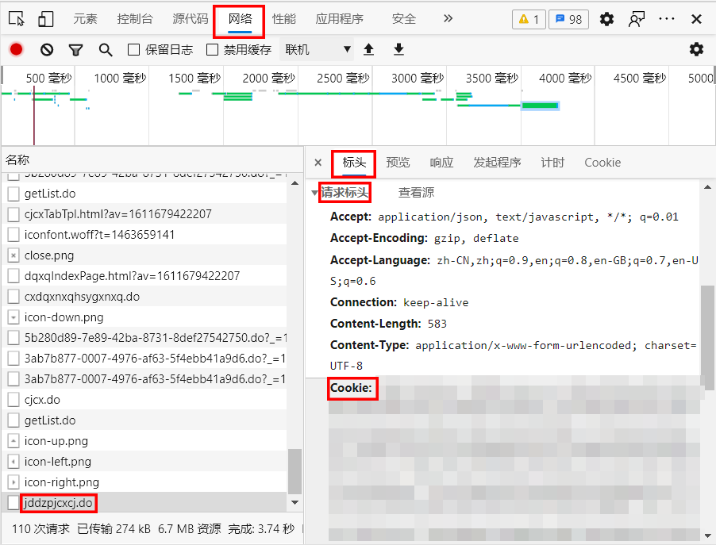

# AverageScore
西安交通大学平均分计算器

语言：`Python 3.7`

### 使用方法

1. 请使用`Chrome`或`Edge`浏览器登陆http://ehall.xjtu.edu.cn/；

2. 进入"成绩查询"服务，按`F12`打开开发者工具，上方工具栏中选中"网络"(`Network`)，在左侧列表中找到`jddzpjcxcj.do`(在最下面)并选中，在右侧“标头”(`Headers`)中找到"请求标头"(`Request Headers`)，将该部分中的`Cookie`冒号右边的内容复制；

3. 打开`AverageScore.py`并运行，按提示粘贴`Cookie`，之后按提示输入学期(比如`2020-2021-1`表示`2020-2021`学年第一学期，如果需要计算所有学期请输入`all`)，程序即可计算出包含以及不包含核心通识课的均分。